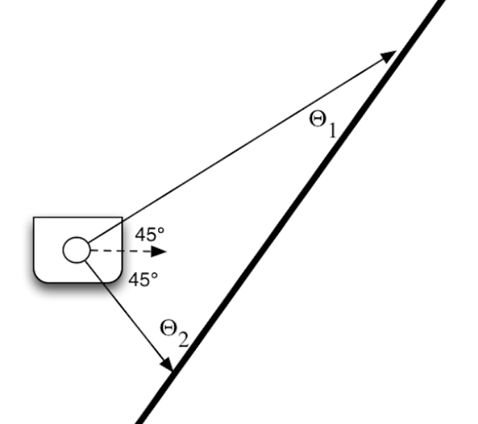

# CompRobo Warmup Project

Kate McCurley

## Introduction

## 1. Robot Teleoperation (Teleop)

The teleoperation node allows the robot to be controlled via the keyboard,
similarly to the given teleop program `teleop_twist_keyboard`.

The implementation of the teleop node maps the four keyboard keys, WASD, to
driving forward (w), driving backward (s), turning left in place (a), and
turning right in place (d). This node consists of two main functions: `run_loop`
and `get_key`. The function `get_key` accesses the keystrokes of the user's
keyboard to determine if any of the controller keys are being pressed. The
`run_loop` function calls this function then based on the result publishes the
corresponding linear and angular velocity.

## 2. Driving in a Square

The drive square node moves the Neato through a 1m by 1m square path.

The implementation of the drive square node uses timing to instruct the Neato
through the steps of driving a square. The task of driving in a square is split
up into two alternating sub-tasks: turning and driving in a straight line. Each
of these sub-tasks is assigned a duration of time, and the speed at which the
Neato travels is calculated such that the Neato will complete each sub-task in
the given duration of time.

## 3. Wall Following

The wall following node instructs the Neato to drive parallel to the nearest
wall, which is determined using data from the Neato's laser scan.

There are two main functions that make up this implementation of the wall
follower: `get_wall_dist` and `follow_wall`. This node subscribes to the `scan`
topic from the Neato, which contains data collected from the laser scan. The
`get_wall_dist` function takes as inputs the laser scan data as well as two
angles, $\theta_1$ and $\theta_2$. The scan data at these angles are used to
find two points on the wall, as shown in the diagram below. 
These two points, $(x_1, y_1)$ and $(x_2, y_2)$ can then be used to solve for
`m` and `b`, the slope and y-intercept of the line representing the wall. From
there, the Neato's perpendicular distance to the wall and angle to the wall are
calculated. The `follow_wall` function then uses this information to adjust the
angle at which the Neato is driving so that it drives parallel to the wall.

The main limitation of this implementation is that it only considers two points
from the Neato's laser scan. If the wall cannot be found from these two points,
the Neato will not know how to behave. This could happen if there are gaps in
the wall or if the wall is not within the given scan range. A future
implementation might use the RANSAC algorithm to better handle these cases.

## 4. Person Following

The person following node instructs the Neato to drive towards the nearest
person, which is determined using data from the Neato's laser scan.

This implementation of person following searches through a 90&deg; field of view
in front of the Neato for the largest object then drives in the direction of
that object. The `run_loop` repeatedly gets the laser scan, finds the largest
object in it, then publishes the appropriate angular and linear velocities. The
function `find_person` is used to process the data from the laser scan and
locate objects within it. The way this works is by finding any significant jumps
in distance within the scan and takes those to be nearby objects. It
approximates the range of angles at which it sees each object, and then chooses
to focus on the object that takes up the largest range of its vision. It then
calculates the approximate center of this object and uses that point from the
laser scan to approximate the distance to this object. Then, the
`vel_controller` function uses these approximations in a proportional controller
to determine the linear and angular velocities at which the Neato should drive.

One limitation of this implementation is that it does not check whether or not
the object it detects is moving - a still object that is closer to the Neato or
larger than a person would become the target instead of a person. A future
implementation might check that the target object is in motion over time rather
than stationary. A second limitation is that only the 90&deg; field of view in
front of the Neato is checked - a future implementation might have the Neato
scan in a full circle before making a decision on what direction to travel in.

## 5. Obstacle Avoidance

The obstacle avoidance node instructs the Neato to move forward while reactively
avoiding any obstacles in its path using the laser scan data.

This implementation of object avoidance turns 90&deg; when it encounters an
obstacle, drives until the obstacle is no longer in the Neato's field of view,
then turns back 90&deg; to continue driving in the original direction.

A more broadly applicable extension on this node could be to implement it such
that the Neato drives towards a given goal rather than just in a particular
direction. This would have the robot reset towards its goal location after
avoiding an obstacle, rather than just returning to driving in the same
direction as which it started. One way to implement this could be by calculating
a potential gradient that guides the robot towards its goal while also pushing
it away from obstacles found by the laser scan.

## 6. Finite State Control

## Conclusion
